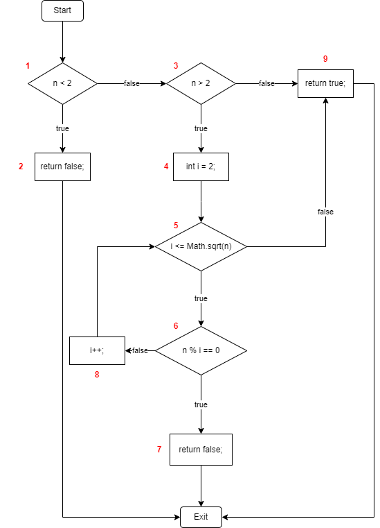

## MAIN FILES 
1. Folder _**img**_: images of set of equations and flow control graph.
2. File **_src/main/java/Prime.java_**: contains function need testing. 
3. File **_src/main/resources/data.csv_**: contains test suites. 
4. File **_src/test/java/PrimeTest.java_**: executes testing. 

## REQUIREMENTS
- IntelliJ
- JDK15
- junit-jupiter 5.6.2

## HOW TO RUN TEST
- Run file **_src/test/java/PrimeTest.java_**

## TEST SUITES

### Flow control graph

**Case 1**: Start -> 1T -> 2 -> Exit

_Test case:_ n = 0

**Case 2**: Start -> 1F -> 3F -> 9 -> Exit

_Test case:_ n = 2

**Case 3**: Start -> 1F -> 3T -> 4 -> 5F -> 9 -> Exit

_Test case:_ n = 3

**Case 4**: Start -> 1F -> 3T -> 4 -> 5T -> 6T -> 7 -> Exit

_Test case:_ n = 4

**Case 5**: Start -> 1F -> 3T -> 4 -> 5T -> 6F -> 8 -> 5F -> 9 -> Exit

_Test case:_ n = 7

**Case 6**: Start -> 1F -> 3T -> 4 -> 5T -> 6F -> 8 -> 5T -> 6T -> 7 -> Exit

_Test case:_ n = 30

## TEST RESULT

